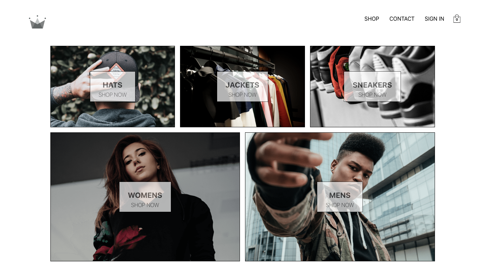

# Jund Clothing

jund-clothing is a React web app for clothing market place. It uses [Firebase](https://firebase.google.com/) for backend service and [Stripe](https://stripe.com/) for handling payment.

## Features

- Categorization
- Payment
- Authentication

## Installation

To get started, fir you have to make sure that you have a package manager installed in your machine, either [NPM](https://docs.npmjs.com/about-npm/) or [Yarn](https://yarnpkg.com/getting-started) will do, although I recommend the former.

> To install the packages through npm, run the command

    npm install

## Running

### Local development mode

To start in your local machine, simply run

    npm run dev

### For production

The main difference of running this app in production mode and development mode is we don't need development dependencies when running this app, it will result in lighter package. To package this app without all the development dependencies and run from this package, simply run the following command

    npm run build
    npm start

## Technologies

- [React](https://reactjs.org/) - JavaScript UI framework
- [Styled Components](https://www.styled-components.com/) - Styling
- [Redux](https://redux.js.org/) - Global state manager

## License

This project is licensed under the MIT License - see the [License](./LICENSE) file for details
